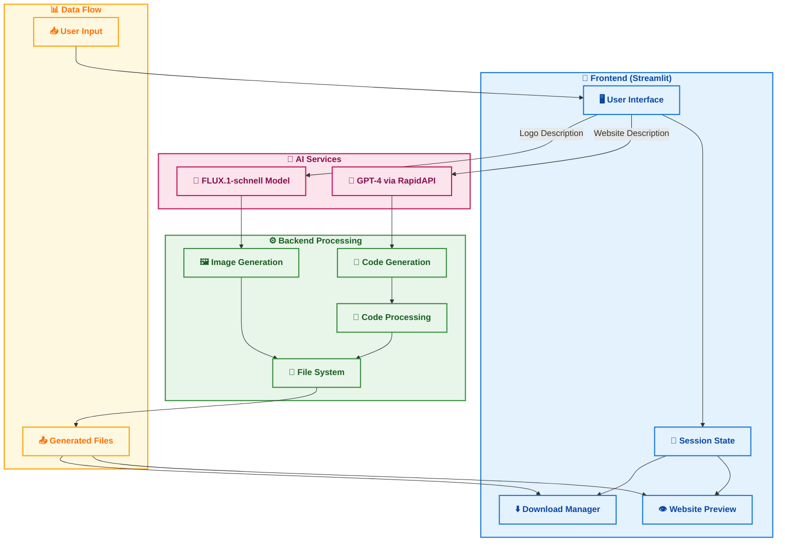

# 🎨 AI-powered Website Generation Tool 🚀

##Welcome to the **GPT-4 Website Generator**! This innovative project combines **Streamlit**, **GPT-4**, and **FLUX.1-schnell** to transform your website ideas into reality with just a few clicks. Create custom websites complete with logos, all powered by cutting-edge AI technology! ✨


## 🌟 Features

1. 🎯 Logo Creation
   * 🖼️ Upload your own logo
   * 🤖 AI-generated logos using FLUX.1-schnell
   * 🎨 Custom logo design based on descriptions

2. 💻 Website Generation
   * 📝 Natural language website descriptions
   * 🎨 Customizable color schemes
   * 🤖 GPT-4 powered code generation
   * 👀 Live website preview

3. 📦 Export Options
   * 💾 Download individual files (HTML, CSS, JS)
   * 📚 Complete website as ZIP archive
   * 🔧 Clean, organized code structure

## 🛠️ Technical Architecture

The **Website Generator** consists of several key components:

> **Note**: This architecture diagram is best viewed on [GitHub.com](https://github.com/Just-a-code-lover/Ghata-AI-Powered-website-generation-tool/blob/main/README.md). If you're viewing this elsewhere, the diagram may appear as code.



### Diagram Components

The architecture consists of four main sections:

1. **Frontend (Streamlit)**
   - User Interface for interaction
   - Session State management
   - Website Preview functionality
   - Download Manager for generated files

2. **AI Services**
   - GPT-4 integration via RapidAPI
   - FLUX.1-schnell Model for image generation

3. **Backend Processing**
   - Code Generation and Processing
   - Image Generation
   - File System management

4. **Data Flow**
   - Handles user input and generated output files

1. **🖥️ Frontend (Streamlit):**
   * User-friendly interface
   * Real-time preview
   * File download options

2. **🤖 AI Integration:**
   * GPT-4 via RapidAPI for code generation
   * FLUX.1-schnell for logo creation
   * BeautifulSoup for code processing

3. **⚙️ Code Processing:**
   * Regex for code separation
   * Clean formatting
   * File organization

## 📋 Requirements

* 🐍 Python 3.7+
* 📚 Libraries:
  * Streamlit
  * Requests
  * BeautifulSoup4
  * Pillow

## 🚀 Getting Started

### 📥 Installation

1. Clone the repository:
```bash
git clone https://github.com/Just-a-code-lover/Ghata-AI-Powered-website-generation-tool_v1.0.0.git

cd Ghata-AI-Powered-website-generation-tool_v1.0.0

```

2. Install dependencies:
```bash
pip install -r requirements.txt
```

3. Set up environment:
```bash
# Create .env file with:
RAPIDAPI_KEY=your_rapidapi_key_here
HUGGINGFACE_API_KEY=your_huggingface_api_key_here
```

### 🎮 Usage

1. Launch the app:
```bash
streamlit run app.py
```

2. Follow the steps:
   * 🎨 Upload/generate logo
   * ✏️ Describe your website
   * 🎯 Choose colors
   * 🚀 Generate and preview
   * 💾 Download your files

## ☁️ Deployment

Deploy to Streamlit Cloud:
1. 🌐 Project deployed at: [Ghata Website Generator](https://ghata-ai-powered-website-generation-tool.streamlit.app/)
2. 🔑 Enter your RapidAPI key
3. 🤗 Enter your Hugging Face API key

Want to deploy your own instance? Follow these steps:
1. 📤 Push to GitHub
2. 🌐 Visit [Streamlit Community Cloud](https://streamlit.io/cloud)
3. 🔗 Connect repository
4. ⚙️ Configure environment
5. 🚀 Deploy!

## 🤝 Contributing

Contributions are welcome! Feel free to:
* 🐛 Report bugs
* 💡 Suggest features
* 🔧 Submit pull requests

## 📄 License

This project is licensed under the MIT License - see the [LICENSE](LICENSE) file for details.

## 🙏 Acknowledgements

* 🤖 OpenAI for GPT-4
* 🎨 Hugging Face for FLUX.1-schnell
* 💻 Streamlit team

---

Made with ❤️ by [Just-a-code-lover](https://github.com/Just-a-code-lover)
